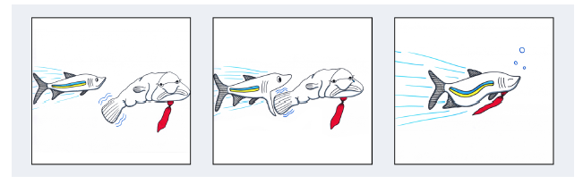
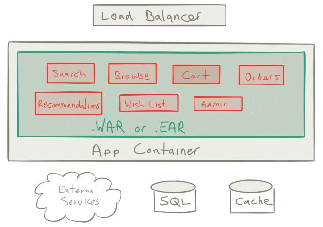

# 1장

## 소개

우리는 다른 선택의 여지가 없을 때만 모노리틱 시스템을 바꿉니다. 빠르게 기회를 잡지 못하고, 마치 카드로 쌓은 집처럼 조금만 건드리면 쓰러질 듯한 엔터프라이즈 시스템을 뒤엎고 다시 만드는 것이 정말 가치있는 건지 곰곰이 생각합니다.  흔히 그 기회는 재빨리 사라지고 그림 1-1 처럼 더 빠른 회사에 잡히게 됩니다.

```
 새로운 세상에서는 큰 물고기가 작은 물고기를 잡아먹는 것이 아니라, 빠른 물고기가 느린 물고기를 잡아 먹습니다.
 - 클라우스 슈밥 (Klaus Schwab, 1938 ~ , 독일 경제학자)
```



그림 1-1. 느린물고기 대 빠른물고기

마이크로서비스 기반의 아키텍처는 간단한 개념입니다. 작은 더미로 서비스를 격리하고, 그 서비스 각각에 독립적으로 분리된 데이터베이스를 갖추며, 확장성이 있고 실패 회복력(resilient to failure)이 있는 시스템을 만드는 것을 지지합니다. 그 서비스들은 우리가 오늘날 구축한 전형적인 엔터프라이즈 시스템보다 훨씬 더 유연한 응집시스템(cohesive system)을 만들기 위해 다른 서비스들과 통합됩니다.


전통적인 엔터프라이즈 시스템은 모노리스로 설계되어 있습니다. 예를 들어, 모든 기능이 하나의 어플리케이션 안에 담겨있고, 어떤 문제를 해결하기 위한 기능이 모두 있거나 아예 없을 수도 있습니다. 시스템  규모를 확장하기도 어렵고 이해하고 유지보수 하는 것도 힘듭니다. 모노리스 시스템은 우리가 혁신, 진보로 나아가고 즐겁게 일하는 걸 억누르는 악몽으로 변질될 수 있습니다. 또한 이 시스템의 부작용은 회사에 큰 재앙을 초래할 수도 있습니다. 사기 저하로 이직율이 높아지거나 능력 있는 개발자의 고용이 막혀 시장에서의 기회를 잃을 수도 있습니다. 극단적인 경우에는 회사가 망할 수도 있습니다.

종종 이런 전쟁같은 이야기가 들립니다. “우리는 경영진에게 승인을 구한 후, 마침내 우리의 자바 엔터프라이즈 어플리케이션을 바꾸기로 결정했습니다. 실제 개발에 들어가기 전에 사전 설계도 꼼꼼하게 살펴봤습니다. 하지만 구축기간 내내 우리는 그 모노리스 시스템의 실제 기능을 파악하는데 대부분의 시간을 썼습니다. 공포가 엄습했고 작은 실수로 생각지도 못한 사이드 이팩트가 생길까 두려웠습니다. 수 개월간의 걱정, 공포, 야근 끝에 드디어 시스템 구축이 끝나고 서비스에 투입되었습니다. 그리고, 그 순간 지옥의 문이 열렸습니다. 생각지도 못한 장애들이 발생하면서 우리는 수일 밤을 장애 처리하느라 지새워야 했습니다.”

친숙한 이야기인가요?

이런 경험담은 우리를 더욱 무기력하게 만들지도 모릅니다. 이것이 시스템과 회사가 침체되어가는 모습입니다. 더 나은 방법이 있다면 어땠을까요? 

> 모든 것은 소비자 경험에서 시작하여 기술로 향해져야 한다.

> \- 스티브 잡스 (Steve Jobs, 1955 ~ 2011, 애플 컴퓨터 창업자)

마이크로서비스의 고객은 그 시스템을 개선하기 위해 투자한 조직들입니다. 개발자, 아키텍트 그리고 주요 이해 관계자들 같은 고객들과 함께 시작하십시오.

당신은 대규모의 시스템이면서 작은 영향력을 갖는 시스템에서 일하는 것을 선호하나요? 아니면 작지만 시스템 구성 요소들이 잘 정의되어 있고 큰 영향력을 갖은 시스템에서 일하는 것을 선호하나요? 당신은 대기업에 속해 있을 때 일이 잘 되나요? 아니면 서로 잘 알고 신뢰하는 사람들과 작은 팀으로 일 할 때 잘 되나요? 당신은 어떤 일을 하라고 대표로 차출되었을 때 일이 잘 되나요? 아니면 창의적인 생각을 할 수 있는 공간이 주어지고 유용한 것을 만들 때 일이 잘 되나요? 마이크로서비스를 시작하세요!

## 서비스 구출하기
```
세상은 고통으로 가득하지만, 한편으로는 그것을 극복하는 일로도 가득합니다.
- 헬렌 켈러 (Helen Keller, 1880 ~ 1968)
```
마이크로 서비스가 기술적인 이유만으로 소프트웨어에서의 새로운 디자인 해법인 것은 아닙니다. 마이크로서비스라는 말에 담긴 개념은 우리가 서비스 지향 아키텍쳐(Service Oriented Architecture, SOA)를 경험하기 전부터 존재해 왔습니다. 다만 일부 기술적인 제약들로 인해 발전되지 못했습니다. 예를들면 느린 컴퓨터와 네트워크, 비싼 디스크와 RAM 그리고 변화에 느린 거대한 단일 조직 문화 때문입니다. 단일 책임 하에서 잘 정의된 컴포넌트들이 조직적인 시스템으로 돌아간다는 이런 개념은 새로운게 아닙니다.

빠르게 2016년으로 가봅시다. 우리가 마이크로서비스로 나아가는데 방해됐던 기술적인 제약 사항들이 사라졌습니다. 빠른 네트워크, 저렴한 디스크와 RAM 그리고 멀티코어 프로세스, 특히 클라우드 아키텍쳐는 시스템을 설계하고 배포하는데 혁명적입니다. 이제 우리는 복잡했던 모노리스 시스템을 마이크로서비스로 바꿀 때가 온 것입니다.

우선, 우리가 처음 소프트웨어 산업에 뛰어든 이유는 소프트웨어를 설계하고 개발하는 것이 재미있었기 때문입니다. 마이크로서비스는 원칙과 기술 그 이상의 것입니다. 마이크로서비스는 시스템을 설계하는 복잡한 문제를 훨씬 더 공감할 수 있는 방향으로 이끌어 줍니다.

마이크로서비스는 우리가 일하는 조직을 시스템 구조와 동일하게 구조화 하는 걸 가능하게 합니다. 팀원 간에 책임을 나누고 자신의 일을 자유롭게 할 수 있도록 보장합니다. 복잡하게 뒤엉킨 시스템을 풀어냄으로써, 중앙 통치 체제로부터 나오던 힘을  소프트웨어를 잘 이해하고 기민하게 유지할 수 있는 작은 팀들로 옮겨갑니다.

## 모노리스 시스템 분할하기

모노리스 시스템에 맞붙는다는 의미는 당신이 습관적으로 써오던 자바 엔터프라이즈 시스템을 냉정히 보기 시작했다는 의미입니다.
모노리틱 방식으로 쓰여진 시스템들은 서비스 [^1] 내부에 컴포넌트 사이나 각 서비스들 간에 강한 결합(strong coupling)을 갖는 경향이 있습니다. 복잡하게 엉키고 상호 의존적인 서비스들로 구성된 시스템은 코드를 쓰거나 이해하고 테스트하고 점진적으로 개선하고 업그레이드 하거나 독립적으로 운영 하는 것이 어렵습니다. 설상가상으로, 강한 커플링은 연쇄적인 장애를 초래할 수도 있습니다. 그 장애만 격리된 상태로 처리되는게 아니라 하나의 장애로 인해 전체 시스템이 다운 될 수도 있습니다.

어플리케이션 서버(예를들면, WebLogic, WebSphere, JBoss, 그리고 비록 EAR 파일을 지원하지 않지만 Tomcat  등)는 모노리틱 모델을 조장한다는 문제가 있습니다. 이 서버들은 당신이 서비스를 JAR나 EAR 파일로 묶어 단일하게 돌고 있는 서버의 인스턴스에 일렬로 나란히 배포할 거라 여깁니다.
이런 어플리케이션 서버는 클래스 로더 기법으로 서비스 분리(isolation)해 관리합니다. 모든 것이 한 데 뭉쳐져 돌아가는 매우 취약한 모델입니다.



그림 1-2. 고전적인 Java EE 아키텍쳐


오늘날 우리는 서비스를 격리(isolation)하기 위해 훨씬 정제된 기반을 갖추고 있습니다. 가상화, 리눅스 컨테이너(Linux containers, LXD), 도커(Docker), 그리고 유니커널(Unikernels) 등이 사용됩니다. 이런 기반은 1급 관심사(first-class concern)로  서비스를 별개로(isolation) 처리하는 것을  가능하게 했습니다. 이것은 회복력(resilience), 확장성(scalability), 지속적 배포(continuous delivery)  그리고 작업 능률을 위해 필수적입니다. 또한 이런 기반 기술은 마이크로서비스 기반 아키텍쳐에 관심이 끌리도록 길을 열어줬고, 모노리스 시스템을 분할하여 각각 독립적으로 개발, 배포, 운영 및 확장하고 관리할 수 있도록 했습니다.

## SOA는 새로운 옷을 입었나?

```
“어쩜 폐하의 새 의상이 너무 멋져요, 정말 잘 맞네요!” 모두가 외쳤습니다.  “멋진 디자인이야! 색상은 어떻고! 진짜로 황제를 위한 의상이다!”
- H.C. 안데르센(H.C. Andersen)의 “벌거벗은 임금님(The Emperor’s New Clothes)”
```

마이크로서비스가 단지 새 옷으로 갈아입은 SAO인지 묻는 것은 적절한 질문입니다. 그 답은 “예” 일 수도 있고 “아니오" 일 수도 있습니다. “예”라고 한다면, SOA의 초기 목적 때문입니다. 디커플링(decoupling), 격리(isolation), 구성(composition), 통합(integration), 분리(discreate) 그리고 자율적으로 컨트롤 되는 서비스(autonomous services) 같은 초기 목표가 같습니다. “아니오"라고 한다면, 오해받고 남용된 SOA의 기본 개념 때문입니다. 여러 모노리스 시스템을 엮는데 사용한 엔터프라이즈 서비스 버스(Enterprise Service Bus, ESB)는 결론적으로 통신하기에 복잡하고 비효율적이고 유연하지 못한 프로토콜로 서비스를 복잡하게 만들었습니다. 

앤 토마스(Ann Thomas)는 “SOA는 죽었다. 장수하는 서비스 (SOA is Dead; Long Live Services)”  라는 그녀의 기사에서 이 부분을 잘 나타내고 있습니다.

```
“SOA”라는 단어는 죽었지만, 서비스 기반 아키텍처에 대한 요구사항은 어느 때보다 강합니다.  
하지만 그건 아마 도전일 될 것입니다. 그 약어는 이제 방해가 됩니다. 
사람들은 SOA가 뭘 의미하는지 잊고 어리석은 기술적 논쟁에 휘말렸습니다. 
(“뭐가 최고의 ESB인가?” 혹은 “접두사로 WS, REST 중 뭐가 낫지?” 등)  
그리고 아키텍쳐와 서비스가 가장 중요한 것이라는 사실을 잊었습니다.

성공적인 SOA (즉, 어플리케이션 재설계)는 현재 상황의 중단이 필요합니다. 
SOA는 존재하는 기존 시스템을 새로운 기술을 써서 개발하고 인터페이스를 만드는 단순한 문제가 아닙니다. 
다시말해 애플리케이션 포트폴리오의 재설계가 필요합니다. 그리고는 IT 운영 방식에 상당한 변화가 요구됩니다.
```

요즘의 소프트웨어 아키텍처 분야는 SOA가 처음 등장했던 10~15년 전에 비해 매우 달라졌습니다. 오늘날에는 멀티 코어 프로세스, 클라우드 컴퓨팅, 모바일 기기 그리고 사물 인터넷(IoT)이 빠르게 생겨나고, 모든 시스템이 처음부터 분산 처리 됩니다. 과거와 비교에 엄청나게 달라졌고 훨씬 도전적인 세상이 되었습니다.
늘 그렇듯,  새로운 도전은 생각의 새로운 방향을 요구합니다. 그리고 우리는 이 도전을 이룰 수 있도록 설계된 새로운 시스템이 등장한 것을 보았습니다. 이 시스템은 반응형 선언문(Reactive Manifesto)에 정의된 반응형 원칙(Reactive principles)에 기반합니다.

이 반응형 원칙은 새로운 것이 아닙니다. 그것을 위해 40년 이상 입증하고 굳건히 하는데 힘을 쓴 사람들의 노력이 있었습니다. 액터 모델을 발명한 칼 휴이트(Carl Hewitt), 탠덤 시스템(Tandem Systems)의 짐 그레이(Jim Gray)와 팻 헬란(Pat Helland) 그리고 얼랭(Erlang)을 개발한 조 암스트롱(Joe Armstrong)과 로버트 버딩(Robert Virding) 등이 그 주인공입니다. 이들은 그들의 시대를 앞섰지만 이제 세상은 그들의 혁신적인 생각을 따라잡고 우리에게 더 큰 발전과제를 주었습니다.

무엇이 마이크로서비스를 흥미롭게 만드나요? 우리는 SOA의 성공과 실패로부터 많은 것을 배웠습니다. 좋은 아이디어는 유지하고 현대적인 인프라와 반응형 원칙을 이용하여 서비스를 기본부터 철저하게 재설계해야 합니다. 요컨데, 마이크로서비스는 근례에 반응형 원칙을 적용한 가장 흥미로운 어플리케이션 중의 하나입니다.

[^1]: 이 문서 안에서 마이크로서비스(Microservice)와 서비스(service)를 교대하여 쓰고 있습니다. 둘 다 반응형 마이크로서비스(Reactive Microservice) 개념을 뜻합니다.

[^2]: 가트너사의 부사장이자 유명한 분석가인 앤 토마스의 SOA is Dead; Long Live Services

[^3]: “The Reactive Manifesto” (반응형 선언문)은 www.reactivemanifesto.org에서 확인할 수 있습니다. 만약 아직 읽지 않았다면 이 책의 남은 내용도 반응형 선언문을 기반으로 하니 바로 읽어볼 것을 추천합니다. 
