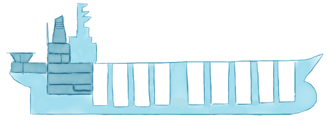

# 2장

## 반응형 마이크로서비스 (Reactive Microservice) 란 무엇인가?

마이크로서비스 기반의 아키텍처 사용에 있어 주된 원칙은 분할과 정복이다(Divide and Conquer):
잘 정의된 프로토콜을 통해 통신하는 별개의 고립된 서브시스템으로 시스템을 분해하는 것.

격리는 회복성과 탄력성을 위한 전제 조건이며, 그들을 분리하는 서비스 사이에 다음과 같은 비동기 통신의 경계가 필요하다.

시간: 동시성 허용

공간: 서비스를 이동 가능하게 하는 배포와 기동성

마이크로서비스를 채택할 때, 공유된 가변 상태를 제거하여 조정, 경합, 일관성을 최소화는 것 또한 필수인데, 이것은 비공유 아키텍처(Share-Nothing Architecture, SNA)를 받아들인 보편적 확장 법칙(Universal Scalability Law)에 정의되어 있다.

자 이제 반응형 마이크로서비스를 정의하는 가장 중요한 부분에 대해 이야기 해 보자.

### 전부 다 분리해라

> 고독 없이는 어떤 중요한 일도 할 수 없다.

> — 파블로 피카소 (Pablo Picasso)

마이크로서비스에서 분리는 가장 중요한 특성이며 수많은 이득의 기반이 된다. 그러나 당신의 디자인과 아키텍처에 지대한 영향을 미치는 특성도 있다. 또한 분리는 아키텍처 전부를 분해할 것이기 때문에 처음부터 고려해야 한다. 심지어 당신이 팀을 해체하고 조직하는데에 있어 그들의 책무에 영향을 줄 것이고 이것은 멜빈 콘웨이 (Melvyn Conway)가 밝혀냈고 1967년에 콘웨이의 법칙이 되었다.

```
시스템의 구조는 그 시스템을 만드는 조직의 구조와 일치한다.
```
작업흐름에 관여하는 서비스들의 연속성 장애를 겪지 않도록 방지하고 관리하는 _장애 격리_ 는 종종 격벽(칸막이) 패턴이라 불린다.

격벽은 수세기 동안 "선체에 틈이나 구멍이 생길 경우 물이 들어오는 것을 막을 수 있도록 방구 구획을 만드는 방법으로" 선박 건조에 사용되어 왔다. 선박은 방수 구획에 물이 찼을 때에도 누수가 더 이상 확산되지 않고 목적지까지 무사히 갈 수 있도록, 분명하고 완전히 격리된 방수 구획으로 나뉘어진다.



그림 2-1. 선박 건조에 쓰이는 격벽

어떤 사람들은 타이타닉호를 반례로 생각할 수 있다. 이것은 적절한 격리가 되지 않았을 때 연속성 장애로 결국 전부가 망가지는 실례이다. 타이타닉호는 격벽이 있었지만, 객실을 분리해야 할 격벽이 천정까지 도달하지 못했다. 16개 중 6개의 객실이 빙산에 의해 뚫리고, 배가 기울면서 여러 객실로 물이 넘치기 시작해 모든 객실이 물에 잠겨 1500명의 사망자를 내며 마침내 타이타닉호는 침몰했다.

장애 허용력-장애로부터 회복할 수 있는 능력-은 구분과 실패 방지에 달려 있으며, 동기식 통신의 강결합(coupling)을 벗어남으로써 얻을 수 있다. 비동기 메시지 전달을 이용해 프로세스 경계간 통신하는 마이크로서비스는 간접 참조의 수준과 장애를 관리하고 수집하는 데 필요한 분리를 가능케 하고 서비스 감독을 사용하는 일반 작업흐름에 관련이 있다.
