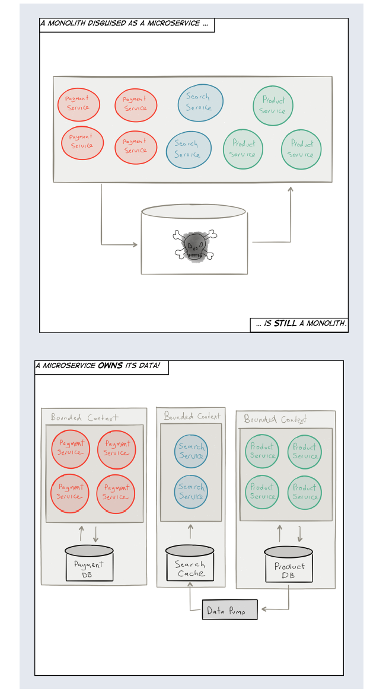

# 2장

## 반응형 마이크로서비스 (Reactive Microservice) 란 무엇인가?

마이크로서비스 기반의 아키텍처 사용에 있어 주된 원칙은 분할과 정복이다([Divide and Conquer](https://en.wikipedia.org/wiki/Divide_and_conquer_algorithms)):
잘 정의된 프로토콜을 통해 통신하는 별개의 고립된 서브시스템으로 시스템을 분해하는 것.

격리는 회복성과 탄력성을 위한 전제 조건이며, 그들을 분리하는 서비스 사이에 다음과 같은 [비동기 통신](http://www.reactivemanifesto.org/glossary#Asynchronous)의 경계가 필요하다.

시간: 동시성 허용

공간: 서비스를 이동 가능하게 하는 배포와 기동성

마이크로서비스를 채택할 때, 공유된 가변 상태를 제거하여 조정, 경합, 일관성을 최소화는 것 또한 필수인데, 이것은 비공유 아키텍처([Share-Nothing Architecture](https://en.wikipedia.org/wiki/Shared_nothing_architecture), SNA)를 받아들인 보편적 확장 법칙(Universal Scalability Law)에 정의되어 있다.

자 이제 반응형 마이크로서비스를 정의하는 가장 중요한 부분에 대해 이야기 해 보자.

### 전부 다 분리해라

> 고독 없이는 어떤 중요한 일도 할 수 없다.

> — 파블로 피카소 (Pablo Picasso)

마이크로서비스에서 분리는 가장 중요한 특성이며 수많은 이득의 기반이 된다. 그러나 당신의 디자인과 아키텍처에 지대한 영향을 미치는 특성도 있다. 또한 분리는 아키텍처 전부를 분해할 것이기 때문에 처음부터 고려해야 한다. 심지어 당신이 팀을 해체하고 조직하는데에 있어 그들의 책무에 영향을 줄 것이고 이것은 멜빈 콘웨이 (Melvyn Conway)가 밝혀냈고 1967년에 [콘웨이의 법칙](http://melconway.com/Home/Conways_Law.html)이 되었다.

```
시스템의 구조는 그 시스템을 만드는 조직의 구조와 일치한다.
```
작업흐름에 관여하는 서비스들의 연속성 장애를 겪지 않도록 방지하고 관리하는 _장애 격리_ 는 종종 [격벽](http://skife.org/architecture/fault-tolerance/2009/12/31/bulkheads.html)(칸막이) 패턴이라 불린다.

격벽은 수세기 동안 "선체에 틈이나 구멍이 생길 경우 물이 들어오는 것을 막을 수 있도록 방구 구획을 만드는 방법으로" 선박 건조에 사용되어 왔다. 선박은 방수 구획에 물이 찼을 때에도 누수가 더 이상 확산되지 않고 목적지까지 무사히 갈 수 있도록, 분명하고 완전히 격리된 방수 구획으로 나뉘어진다.


그림 2-1. 선박 건조에 쓰이는 격벽

어떤 사람들은 타이타닉호를 반례로 생각할 수 있다. 이것은 적절한 격리가 되지 않았을 때 연속성 장애로 결국 전부가 망가지는 실례이다. 타이타닉호는 격벽이 있었지만, 객실을 분리해야 할 격벽이 천정까지 도달하지 못했다. 16개 중 6개의 객실이 빙산에 의해 뚫리고, 배가 기울면서 여러 객실로 물이 넘치기 시작해 모든 객실이 물에 잠겨 1500명의 사망자를 내며 마침내 타이타닉호는 침몰했다.

장애 허용력-장애로부터 회복할 수 있는 능력-은 구분과 실패 방지에 달려 있으며, [동기식 통신](https://en.wikipedia.org/wiki/Synchronization_(computer_science))의 강결합(coupling)을 벗어남으로써 얻을 수 있다. 비동기 메시지 전달을 이용해 프로세스 경계간 통신하는 마이크로서비스는 간접 참조의 수준과 장애를 관리하고 수집하는 데 필요한 분리를 가능케 하고 서비스 감독을 사용하는 일반 작업흐름에 관련이 있다.

서비스간의 분리는 지속적인 배포([Continuous Delivery](https://en.wikipedia.org/wiki/Continuous_delivery))를 쓰는 것이 당연하다. 이것은 애플리케이션을 안전하게 배포하고 출시하고 변경사항을 점진적으로 되돌릴 수 있게 해 준다.

격리는 또한 독립적으로 디버깅과 테스트를 통해 모니터링할 수 있을 뿐만 아니라 각 서비스들을 확장 가능하게 한다. 하지만 서비스들이 거대한 하나의 조직으로 뒤엉킨다면 이것은 매우 어렵다.


그림 2-2. 마이크로서비스의 컨텍스트간 경계

### 독립적으로 행동해라

> Insofar as any agent acts on reason alone, that agent adopts and acts
only on self-consistent maxims that will not conflict with other
maxims any such agent could adopt.
Such maxims can also be adopted by and acted on by all other agents acting on reason alone.

> —Law of Autonomy by Immanuel Kant

격리는 자율성의 전제 조건이다. 오직 서비스들이 분리되었을 때에만 완전히 자율적이며 독립적으로 의사결정하고 작동하며, 다른 서비스들과 협력하며 조직화해 문제를 해결할 수 있다.

[자율적인 서비스](https://en.wikipedia.org/wiki/Service_autonomy_principle)만이 프로토콜/API를 공개하여 자신의 행위를 보장할 수 있다. 이 단순하지만 기본적인 사실을 인정하는 것은 우리가 자율적인 서비스를 이해하고 협업 시스템을 만드는 데 지대한 영향을 끼친다.

자율성의 또 다른 측면은 서비스가 단지 자신의 행위만 보장된다면, 통신 및 조정하지 않고도 스스로 충돌을 해결할 수 있거니와 장애 발생시 복구도 가능하다는 점이다.

자율적인 서비스는 확장성, 가용성, 실시간 관리 뿐만 아니라 서비스 통합의 유연성, 작업흐름의 관리, 공통적인 기능들을 가능하게 한다.심사숙고하여 만든 잘 정의된 API는 공감대를 만들 수 있는데, 이것에 대해 곧 이야기할 것이다.

### 한 가지에만 집중해라

> 유닉스 철학: 하나만 제대로 동작하는 프로그램, 함께 작동하는 프로그램을 만들어라.

> -덕 맥일로이 (Doug McIlroy)

유닉스 철학과 디자인은 시초부터 여전히 매우 성공적이고 굳건히 존재하고 있다. 유닉스 철학의 핵심 원칙 중 하나, 개발자는 단일 목적을 지닌 작고 잘 작성된 기능을 가지며 다른 프로그램과 잘 어울리는 프로그램을 만들어야 한다.

이 발상은 후에 로버트 마틴의 객체지향 프로그래밍 커뮤니티의 발판이 되었다. 그리고 마틴은 클래스나 컴포넌트는 단 하나의 변경하려는 이유만을 가져야 한다는 단일 책임 원칙(SRP)을 소개했다.

마이크로서비스의 범위에 대해서는 많은 주장들이 있다. 대체 어디까지 "마이크로"라 하는가? 대체 얼마나 몇 라인의 코드까지 마이크로서비스라 할 수 있는가? 이것들은 전부 잘못된 질문이다. "마이크로"는 책임의 범위를 가리켜야 하며, 여기서의 기준 원칙은 SRP의 유닉스 철학이다: 하나만 제대로 동작하게 해라.

만약 서비스가 하나의 기능만을 제공하기 위해 존재한다면, 비지니스 도메인과 책임은 서로 뒤얽히지 않을 것이다. 그리고 각각의 서비스는 더욱 널리 유용하게 만들 수 있고, 시스템을 전체적으로 탄력있고 확장, 유지보수 및 관리하기가 쉬울 것이다.

### 독점적인 상태를 가져라
> 사생활 없이 개인은 아무 의미가 없었다.

> -조너선 프랜즌 (Jonathan Franzen)

지금까지, 마이크로서비스를 각각의 영역에서 책임을 가지고 있는 고립된 서비스의 집합으로 특정지었다. 마이크로서비스는 각각의 서비스를 회복력의 전제조건인 분리에 죽고사는 단일의 구성 단위로 다룰 수 있는 근거가 되었고, 또한 탄력성의 전제조건인 분리 안에서의 이동이 가능하게 하였다.

이 모든 것들이 좋은 생각 같긴 한데, 우리는 지금 상태에 대하여 애써 모른척 하고 있다.

마이크로서비스는 때때로 상태 기반의 엔티티이다: [OOP](https://en.wikipedia.org/wiki/Object-oriented_programming)나 [Actor Model](https://en.wikipedia.org/wiki/Actor_model)과 유사하게, 그리고 확실히 단일 단위로 여겨지는 상태를 요구하는 분리를 캡슐화한다.


불행하게도, 많은 웹 프레임워크들이 그러하듯이 서비스의 상태를 거대한 하나의 공유 데이터베이스에 밀어넣는 state가 없는 controller-style의 서비스들을 "stateless" 아키텍처라 부르며 문제를 무시하는 것은 원하는 만큼 도움이 되지 않을 것이다. 그리고 third-party에 문제를 위임할 뿐이어서
확장성 뿐만 아니라 데이터 무결성 보장 그리고 가용성 보장 둘 다 제어하기가 힘들어질 것이다(그림 2-3 참조).



그림 2-3. 위장한 단일 조직은 여전히 단일 조직이다.

각각의 마이크로서비스는 자신의 상태와 지속성에 대해 유일하게 책임을 가져야 한다. 컨텍스트를 나누어 각 서비스를 설계하는 것은 흔한 언어를 가지는 자신만의 도메인을 정의하기 때문에 도움이 될 수 있다. 이러한 두 기술은 [도메인 주도 설계(DDD)](https://en.wikipedia.org/wiki/Domain-driven_design)에서 비롯되었다. 여기에서 소개하는 모든 새로운 개념의, 학습을 시작하기에 좋은 DDD를 고려해 보아라. 마이크로서비스는 DDD에 지대한 영향을 받았고 마이크로서비스에서 볼 수 있는 대다수 용어들 또한 DDD로부터 나왔다. Bounded Context를 통해 다른 마이크로서비스와 통신할 때, 그것의 상태만 정중히 요청할 수 있지 강제로 밝힐 수는 없다. 각 서비스는 현재 상태에서 파생된 불변의 데이터의 요청에 자체적으로 응답하지만, 서비스의 가변 상태를 직접적으로 드러내진 않는다.

이것은 결국 각 서비스가 원하는 상태를 나타내고 가장 적합한 형식과 매체에 저장할 수 있는 자유를 준다. 일부 서비스는 전통적인 관계형 데이터베이스 시스템([RDBMS](https://en.wikipedia.org/wiki/Relational_database_management_system))(Oracle, MySQL, Postgres 포함)이나 [NoSQL 데이터베이스](http://nosql-database.org/)([Cassandra](http://cassandra.apache.org/), [Riak](http://basho.com/products)), [시계열 데이터베이스](https://en.wikipedia.org/wiki/Time_series_database)([InfluxDB](https://influxdata.com/), [OpenTSDB](http://opentsdb.net/))를 선택할 수 있고, 이벤트 소싱이나 CQRS를 통해 이벤트 로그([Kafka](http://kafka.apache.org/), [Amazon Kinesis](https://aws.amazon.com/kinesis/), Cassandra)를 사용한다.

분산 데이터 관리 및 지속성에서 얻을 수 있는 이점은 종종 *Polyglot Persistence* 라 불린다. 사실 어떤 저장 매체를 사용하느냐는 중요하지 않다. 중요한 것은 상태와 행동을 포함하여 단일 단위로 취급될 수 있다는 것이며 그러기 위해선 각 서비스는 자신만의 상태를 독점적으로 가져야 한다는 점이다. 이것은 한 서비스가 다른 서비스의 저장소를 직접 호출하는 것을 허용하지 않고 API를 통해서만 허용하기 때문에 프로그램에 따라 강제하기가 까다로울 수 있으므로 관례, 방침을 따르거나 코드 리뷰를 하지 않으면 안 된다.

*이벤트 로그* 는 메시지를 영구적으로 저장한다. 우리는 외부에서 *명령* 이 서비스로 들어올 때 메시지를 저장하도록 선택할 수 있는데, 이것은 흔히 *Command Sourcing* 이라 불린다.
